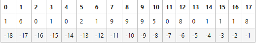

# Python Learning For AI Learning

## 除法&取模

/表示普通除法

//表示整数除法（**向下取模**）

取余%

**余数的符号与除数符号一致，与被除符号无关**

## 赋值

python支持**连续赋值**和**同步赋值**

```python
a=b=6
a, b=4, 5
```

交换变量的值可以选择：1.使用中间变量来过渡；2.使用同步赋值`a,b=b,a`

## 输入

```python
a,b=map(int,input().split())
```

在算法竞赛中，`a, b = map(int, input().split())` 是标准写法
`split()`:这是字符串方法，默认以空格为分隔符，将字符串拆分成一个列表
`map(function, iterable)` 是一个 Python 内置函数，将 function 应用到 iterable 的每个元素。

等价写法（更verbose的写法）

```python
line = input()          # 读取 "48 18"
numbers = line.split()  # 分割成 ["48", "18"]
a = int(numbers[0])     # 转换为整数 48
b = int(numbers[1])     # 转换为整数 18
```

## 链式比较

形如`a op1 b op2 c`,这里`op1`、`op2`是做比较的关系运算符，Python的计算规则是：`a op1 b and b op2 c`

## 复数

Python中支持复数运算，在字面量中用字母j代替i

```python
c1 = 12 + 0.2j
print("c1Value: ", c1)
print("c1Type", type(c1))

c2 = complex(6, 1.2)
print("c2Value: ", c2)

#对复数进行简单计算
print("c1+c2: ", c1+c2)
print("c1*c2: ", c1*c2)
```

**复数运算**

```python
aa=10-12j
print(aa.real)  # 实数部分 10.0
print(aa.imag)  # 虚数部分 -12.0
print(abs(aa))  # 复数的模 15.620499351813308
print(aa.conjugate()) # 共轭复数 (10+12j)
```

## 字符串

### **字符串运算**

- `len()`返回字符串的长度

- 字符串的`*`可以产生重复的长字符串

  `'*'*10` --> `**********`

- `+`可以连接两个字符串

**如何得到字符串中间连续的字串？**
### **切片Slice**

```python
s='160102199905080118'
s[6:14]
'19990508'
```

### **下标可以为负数**

- 最右边（后）的字符的下标也可以用-1来表示
- 负的下标从右向左递减，从-1开始



**将负数下标与Slice结合**

```python
wendu='36.16546C'
wendu[:-1]#wendu[0:-1]
'36.16546'
```

**切片如何直到最后一位**

`str[3:]`省略即可

- 从字符串中取出其中**连续的一段**的操作叫做切片
- 切片由带**有冒号的方括号**来表达，如`s[a:b]`表示从`s[a]`到`s[b-1]`的内容取出来成为一个新的字符串
- 切片中的元素编号也可以是**负数**，来表示**从右边开始**的编号
- 当切片中的第一个元素编号不存在时，表示**从头开始**，当第二个编号不存在时，表示到最后一个为止
- 切片还可以有**第二个冒号和第三个数据**，表示从切片头**开始每次加多少**（**步长**）

**特殊情况**

```python
s='Zhejiang'
s[::-1]
'gnaijehZ'
```

### **长字符串**

```python
s1 = '''
this is the 1st line
this is a long string
this is the 3rd line
'''
s2 = "this is another \
long string"
print(s1)
print(s2)
```

- 用3个引号（单引号或双引号）括起来的字符串可以包含多行字符串
- 如果要在程序中用多行表示一个字符串，则可以在每行的结尾用反斜杠（\）结束
- 三个引号的字符串会自动把换行做进字符串数值里，而`\`换行的字符串不会

### **转义字符**

| \t     | \n       | \\   | "    | ’    | \ooo  | \xnum1num2 |
| ------ | -------- | ---- | ---- | ---- | ----- | ---------- |
| 制表位 | 回车换行 | \    | "    | ’    | 8进制 | 16进制     |

`\x` 是 Python 字符串中的一种转义序列，用于以十六进制表示一个字符的 ASCII 或 Unicode 编码值。它后面必须紧跟两个十六进制数字（例如 \x31、xFF）。

### 字符串是不可修改的

- 字符串中的数据（字符）是不可修改的
- 如果直接根据索引修改会报错
- 可以通过用新的字符串对变量重新赋值，表示新的字符串

### 字符串函数

```python
s=s.lower()
find() 在字符串中查找子字符串所在的位置，如果找不到就返回-1。当子字符串是单个字符时，就是查找这个字符第一次出现的位置
find() 还有第二和第三个参数，用来表示从哪里开始，到哪里结束
count() 统计子字符串出现的次数，当子字符串里面只有一个字符时，就是统计字符出现的次数
strip()、rstrip()和lstrip() 去掉字符串两端的空格
replace() 替换子字符串为其他子字符串
upper()、lower()、title() 调整大小写
```

### 编码

`ord()`用于获得单个字符的Unicode编码

`chr()`用于获得某个编码所代表的字符

它们常用于单个字符上的计算

```python
ord('A')
chr(65)
chr(ord('A')+1)
```

### 遍历循环

- `for...in`用来遍历一个可以被遍历的数据，在循环的每一轮，取数据中的一项作为变量`x`的值来使用
- 可遍历的数据：字符串、列表、元组、集合，以及迭代器

### split

`a, b = map(int, input().split('/'))`

- `split()`根据所给的参数字符串，将字符串分隔为一些字符串，放在一个列表里

`12/18'.split('/')`-->`['12', '18']`

- 用`[]`括起来的这个值是一个列表，这里有两个元素，元素之间用逗号`,`分隔

### list

- 由一系列按照指定顺序排列的元素组成。列表中的元素可以是不同类型
- 列表的字面量用方括号（`[ ]`）将元素括起来，元素之间用逗号（`,`）分隔
- 列表和字符串一样是序列类型的一种，字符串的下标、切片、`len(`)、`*`这些操作对于列表都是成立的，除此之外，列表还有自己的特殊操作

```python
t=[1,2,3,'a']
print(type(t))
print(t)
print('a')
<class 'list'>
[1, 2, 3, 'a']
a
```

